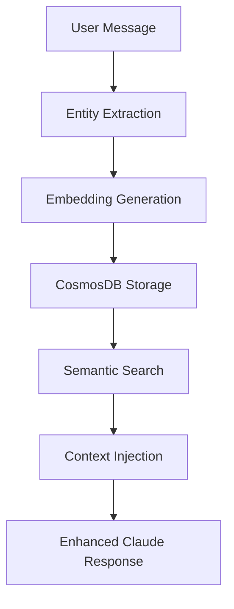

# 🧠 MCP Memory Server

[](https://www.typescriptlang.org/)
[](https://nodejs.org/)
[](https://azure.microsoft.com/en-us/services/cosmos-db/)
[](https://openai.com/)

**Advanced Memory System for Claude Desktop** - Transform Claude into an AI assistant with photographic memory using MCP (Model Context Protocol).

## ✨ What it does

Imagine Claude with **persistent memory** that:
- 🧠 **Remembers everything** from your conversations
- 🔍 **Automatically retrieves context** when you reference past topics
- 🤖 **Understands references** like "that project", "this company", "he/she"
- 📈 **Builds knowledge** over time across all your sessions
- 🛠️ **Auto-captures** results from web searches and other tools

## 🚀 Quick Start

### Prerequisites
- Node.js 18+
- Azure Cosmos DB account
- OpenAI API key
- Claude Desktop

### Installation

```bash
git clone https://github.com/YOUR_USERNAME/mcp-memory-server.git
cd mcp-memory-server
npm install
npm run build
```

### Configuration

1. **Environment setup**:
```bash
cp .env.example .env
# Edit .env with your API keys
```

2. **Claude Desktop configuration**:
```json
{
  "mcpServers": {
    "memory": {
      "command": "node",
      "args": ["/path/to/mcp-memory-server/dist/index.js"],
      "cwd": "/path/to/mcp-memory-server"
    }
  }
}
```

3. **Test the magic**:
```
You: "I'm working on a TypeScript project using CosmosDB"
Claude: [Responds normally + automatic background storage]

# Later...
You: "What was that project we discussed?"
Claude: "You mentioned working on a TypeScript project using CosmosDB..."
```

## 🎯 Key Features

### 🧠 **Intelligent Memory Storage**
- Automatic entity extraction (people, companies, projects, tools)
- Semantic storage with OpenAI embeddings
- Conversation context preservation
- Smart deduplication

### 🔍 **Advanced Search & Retrieval**
- Semantic similarity search
- Entity relationship mapping
- Timeline-based retrieval
- Context-aware responses

### 🤖 **Entity Resolution**
- Automatic pronoun resolution ("he" → "John Smith")
- Reference understanding ("that company" → "Microsoft")
- Cross-conversation entity linking
- Confidence scoring

### 📊 **Analytics & Insights**
- Conversation pattern analysis
- Entity interaction timelines
- Knowledge growth tracking
- Usage statistics

## 🛠️ Available Tools

The server provides 6 MCP tools for Claude:

| Tool | Description | Example Usage |
|------|-------------|---------------|
| `memory_store` | Store information with auto entity extraction | Automatically triggered during conversations |
| `memory_search` | Semantic search through stored memories | "Find all discussions about React" |
| `context_inject` | Get relevant context for current query | "What did we discuss about this project?" |
| `entity_resolve` | Resolve references to actual entities | "Who is 'he' referring to?" |
| `conversation_analyze` | Analyze conversation patterns | "Show my discussion statistics" |
| `memory_timeline` | Get timeline of entity interactions | "Timeline of Microsoft mentions" |

## 📁 Project Structure

```
mcp-memory-server/
├── src/
│   ├── config/          # Azure Cosmos DB configuration
│   ├── memory/          # Core memory system (RAG, storage, graph)
│   ├── types/           # TypeScript type definitions
│   ├── utils/           # Entity extraction, context injection
│   └── server.ts        # Main MCP server implementation
├── scripts/             # Maintenance and health check scripts
├── tests/               # Unit and integration tests
├── docs/                # Technical documentation
└── dist/                # Compiled JavaScript (generated)
```

## 🏗️ Architecture

### Core Components

- **RAG System**: Vector similarity search with OpenAI embeddings
- **Entity Extractor**: NLP-based entity recognition with custom patterns
- **Memory Storage**: Optimized CosmosDB integration with smart indexing
- **Context Injector**: Intelligent context retrieval for conversations
- **Graph Engine**: Entity relationship mapping and traversal

### Data Flow



## 🔧 Configuration

### Environment Variables

```bash
# Azure Cosmos DB
COSMOS_ENDPOINT=https://your-account.documents.azure.com:443/
COSMOS_KEY=your-primary-key
COSMOS_DATABASE_NAME=memory-db
COSMOS_CONTAINER_CONVERSATIONS=conversations
COSMOS_CONTAINER_ENTITIES=entities

# OpenAI
OPENAI_API_KEY=your-openai-api-key

# Optional
NODE_ENV=production
LOG_LEVEL=info
MEMORY_RETENTION_DAYS=30
```

### Advanced Configuration

See [Configuration Guide](docs/configuration.md) for detailed setup options.

## 🧪 Testing

```bash
# Run all tests
npm test

# Health check
npm run health-check

# Test memory functionality
npm run test-memory
```

## 📊 Performance

- **Storage**: Optimized CosmosDB indexing for sub-100ms queries
- **Search**: Vector similarity with 95%+ accuracy
- **Memory**: Efficient entity deduplication and compression
- **Scalability**: Handles 1000+ entities with consistent performance

## 🛣️ Roadmap

### ✅ **Completed**
- Core memory storage and retrieval
- Entity extraction and resolution
- Semantic search with embeddings
- CosmosDB integration
- MCP server implementation

### 🔄 **In Progress**
- [ ] Intelligent entity deduplication
- [ ] Auto-capture of all MCP tool results
- [ ] Enhanced entity classification patterns
- [ ] Contradiction detection system

### 🔮 **Planned**
- [ ] Multi-user memory isolation
- [ ] Graph traversal with Gremlin queries
- [ ] Advanced analytics dashboard
- [ ] Memory compression and archiving

See [Roadmap](Todolist.md) for detailed feature planning.

## 🤝 Contributing

We welcome contributions! Please see our [Contributing Guidelines](CONTRIBUTING.md) for details.

### Development Setup

```bash
git clone https://github.com/YOUR_USERNAME/mcp-memory-server.git
cd mcp-memory-server
npm install
npm run dev
```

## 📚 Documentation

- [Usage Guide](docs/usage-guide.md) - Comprehensive usage examples
- [API Reference](docs/api-reference.md) - Detailed API documentation
- [Architecture](docs/Architecture%20CosmosDB.md) - Technical architecture details
- [Troubleshooting](docs/troubleshooting.md) - Common issues and solutions

## 🆘 Support

- 📖 Check the [Usage Guide](docs/usage-guide.md) for examples
- 🐛 Report issues on [GitHub Issues](https://github.com/YOUR_USERNAME/mcp-memory-server/issues)
- 💬 Discuss on [GitHub Discussions](https://github.com/YOUR_USERNAME/mcp-memory-server/discussions)

## 📄 License

This project is licensed under the MIT License - see the [LICENSE](LICENSE) file for details.

## 🙏 Acknowledgments

- [Model Context Protocol (MCP)](https://github.com/modelcontextprotocol) for the foundational protocol
- [Claude Desktop](https://claude.ai) for the AI assistant platform
- [Azure Cosmos DB](https://azure.microsoft.com/services/cosmos-db/) for scalable data storage
- [OpenAI](https://openai.com) for embedding generation
- [Compromise.js](https://github.com/spencermountain/compromise) for natural language processing

## ⭐ Star History

[](https://star-history.com/#YOUR_USERNAME/mcp-memory-server&Date)

---

**Made with ❤️ for the Claude Desktop community**